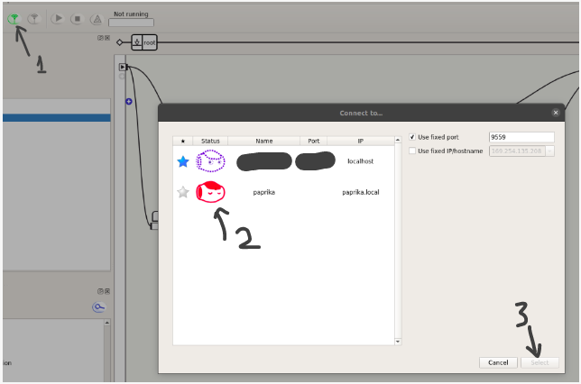
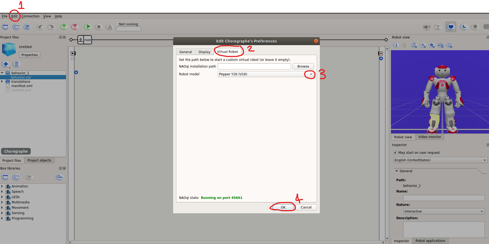
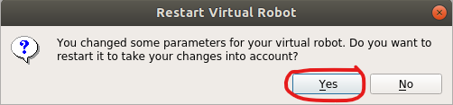
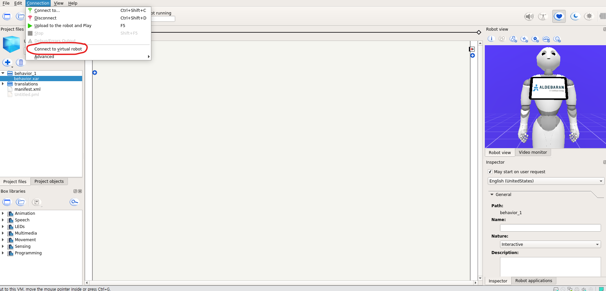

# Installing Choregraphe

1) Navigate to https://www.softbankrobotics.com/emea/en/support/pepper-naoqi-2-9/downloads-softwares, take note of the installation key and download the Linux Setup package.  
  
  
  
2) In a new terminal begin installation with `chmod +x choregraphe-suite-x.x-linux64-setup.run` and then `sudo ./choregraphe-suite-x.x-linux64-setup.run`. Please note that `choregraphe-suite-x.x` would be `choregraphe-suite-2.5.10` in this particular example.
  
3) Complete the installation wizard using the installation key from the previous website.  
  
4) Run the application from system applications, from your desktop or through `Choregraphe` in terminal. If the application does not boot properly a library link might not have been added during installation. To remedy the issue type this command in terminal `sudo ln -sf /usr/lib/x86_64-linux-gnu/libz.so /opt/Softbank\ Robotics/lib/libz.so.1`. If the command doesn't work, try again but tab through the directories appropriate to your computer. This solution worked for Ubuntu 18.04 and 20.04 and was available at https://stackoverflow.com/questions/54450088/choregraphe-software-doesnt-launch.
  
  
5) You should now be able to start the Choregraphe software!  
  
# Connecting to Pepper via Ethernet
1) Connect and power pepper through the power cord avialble.

   
   
2) Take out pin stored next to emergency stop button and insert into two holes behind Peppers' head to open access for ethernet plug.
   
   
  
3) Plug a ethernet cable connecting pepper and a PC/Laptop (with Choregraphe).

   
   
   
4) Go to settings for wired connection on device connected to pepper with ethernet.

5) Input the following:
   a) Go to "IPv4" tab
   b) Select "Manual" as IPv4 method
   c) Assign laptop an address (in the below case just changed the last number of Pepper IP.
   d) Input Netmask `255.255.255.0`
   e) Input the Pepper's IP adress as Gateway
   
   
   
6) Open new terminal to check connection with Pepper `ping 169.254.180.154` (this IP address belongs to Pepper)
   
   

7) Open Choregraphe and connect on the application to Pepper.
  

8) Once connection is established, you are free to explore the features or add your own program.
   
   

# Working with Virtual Pepper

1) When you want to work on the Pepper robot remotely, a virtual robot can be uploaded. After installing Choregraphe, by default, it will show up a different robot. To load pepper: 
   a) go to edit
   b) -> Virtual Robot
   c) -> Select the 'Robot model' from the dropdown menu
   d) -> press ok
   
   
   
   e) -> A popup may appear requesting user to restart. Click ok
   
   
   
   f) Under the tabs, click Connect -> Connect to virtual robot
   
   
