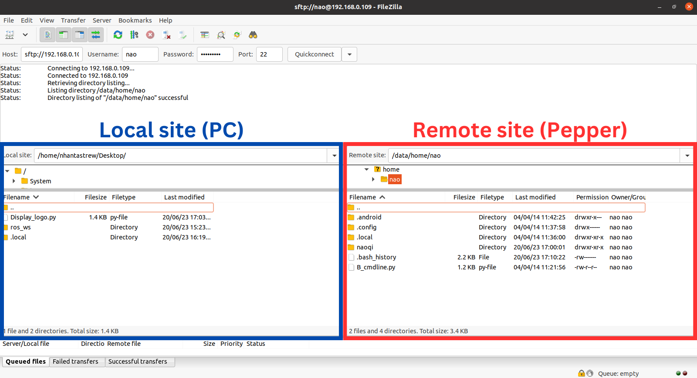
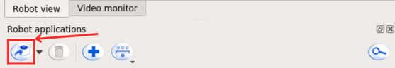
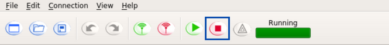

# Installing NAOqi Operating System

Peppers have the [hardware version](https://support.aldebaran.com/support/solutions/articles/80000963170-is-my-pepper-a-1-7-1-8a-or-1-8-hardware-version-) 1.8a (based on the robot's serial number found at the back of the robot). 

  

This version is compatible with NAOqi 2.5 supported by the Python SDK and NAOqi 2.9 supported by the Android SDK. 

  

## Install the latest NAOqi 2.5 system OS image (2.5.10.7 as of 20/4/2018)

To check the version of the robot, navigate to the robot settings labelled by the **boot-config** icon. If the tablet is not jailbroken (apps cannot be accessed directly through the tablet), either:

1) Open the Choreographe Suite and connect to the robot based on the instructions provided in the [Operating Guide]([`Operating Guide.md`](Operating%20Pepper%20Guide.md)
). After connecting, in the app menu play the boot-config application and it launch on the tablet.

  

2) Open a browser and connect to the robot through its IP. To get the IP press Pepper's chest button once. The credentials to login to the robot are then (procedure to set these up referenced later):

```
nao
Habanero1
```

The main settings screen should display the NAOqi version of Pepper:

  

If the version is not 2.5.10.7, we need to update the NAOqi system. The easiest method to achieve this without going through verification or security checks that usually require credentials that a user might not have is to update the robot's system through Choreographe. In updating the robot system, it can either be factory reset or simply updated with all the data contained in it kept. We choose to factory reset it, but if you do so, ensure that the robot's data is backed up (check instructions to access robot data and back it up in the [backing up data](#backing-up-data) session). If no factory reset is needed, skip to [switching the tablet's default launcher](#switching-the-tablet's-default-launcher).

1) Download and extract the system image [here](https://www.robotlab.com/hubfs/pepper-x86-2.5.10.7_2018-04-20_with-root.opn).

2) In Choreographe, while connected to the robot, head to `Connection` > `Advanced` > `Update robot system`.

  

### Backing up Data
To access the robot data we need a file transfer protocol software. Depending on the local OS, there are a few options:

1) **Linux:** [FileZilla](https://filezilla-project.org/download.php)
2) **Windows:** [WinScp](https://winscp.net/eng/download.php), [FileZilla](https://filezilla-project.org/download.php)

We will use FileZilla. The functionalities in WinScp closely resemble those in FileZilla, so the same steps should still apply. Connect to the robot with its `Host IP`, `Username`, `Password`, and `Port`. By default, secure file transfer protocol (SFTP) uses SSH's default port - **port 22** for authentication, control, and data transfer. 

  

To back up the data download the files from the remote site (Pepper) to the local site (PC or external drive).

### Configuring the robot 
The robot should reboot, with the shoulders and ears' lights blinking blue. It should take around 15-20 minutes to install the system OS, and the robot should automatically boot up and mention the version that has just been installed. With the OS installed, get the robot IP and connect to it through a browser to access the **Getting Started Wizard**. Then, register the robot using the SoftBank community account credentials (Another account can be set up if available). The **user** and **password** are:

```
robofieldpepper@gmail.com
R0b0Fie!d
```

Set the **password** for the robot to be:
`Habanero1`

The default **username** of the robot in this instance will be `nao`. To change the name of the robot ssh into it from a terminal window by running:

```
ssh -X nao@IP
```

Make sure that the robot is running in the NAOqi shell environment (with the format `ROBOTNAME [0] ~ $`) since all the necessary environment variables to run Pepper's services are set up there. If the current environment is `nao@ROBOTNAME ~ $`, run `exit` on the terminal and the shell should default to the NAOqi environment. 

  

Input the password if asked, and run the service to set the robot name:

```
qicli call ALSystem.setRobotName NEWROBOTNAME 
```

Reboot Pepper for the changes to reflect. For more information regarding the various services that can be called to the robot refer to the [NAOqi API documentation](http://doc.aldebaran.com/2-5/naoqi/index.html).

# Switching the tablet's default launcher 

Pepper's default bootstrap loader usually launches to a constant loading screen, unless an application is ran through a python executable using the official SDK or Choreographe Suite. This screen usually does not allow interaction with the tablet whatsoever until an application is launched. To make the tablet usable on a Pepper 1.8a, for debugging and installation of Android apps, we need to change the robot's default launcher. 

While ssh'ed to the robot run the following service in the NAOqi shell terminal:

```
qicli call ALTabletService._openSettings
```

The tablet screen should display the Android settings. 

  

Browse for `Home` and change the default launcher to `Launcher3`. 

  

The Android shell will now be the default launcher, that boots up once the robot is turned on. Additionally, enable **Developer mode** on Pepper to allow the development of external apps. The [procedure](samsung.com/uk/support/mobile-devices/how-do-i-turn-on-the-developer-options-menu-on-my-samsung-galaxy-device/) is the same as that on a smart phone:

1) Go to `About tablet`.

2) Scroll down to find the `Build number`, then tap 5 times quickly. You should see the toast opes and say that developer mode is activated.

3) Activate the `Developer Option`.

Reboot Pepper. The robot should now bootup showing the Android shell. If kept in that state, note that the Pepper is **offline**, meaning that no apps can be run on it since the services are unreachable. It also makes the robot wait for roughly 8-9 minutes of downtime until it stands up. To make the Pepper go online to access its services, the Aldebaran bootstrap loader must be launched. In the Android shell this is the `jp.softbank.custombrowser.MainActivity`. Browse for it in the app menu and launch it. The robot should immediately stand up and run through it's usual boot up procedure. 


# Launching built-in apps from the tablet
With the Aldebaran bootstrap loaded, the tablet may default to the static loading screen that hinders the tablet's functionality. To access the robot's apps, displayed in Choreographe, we need an interface that will provide such access. 


Fortunately, there is an official app launcher development from SoftBank Robotics in this [repository](https://github.com/softbankrobotics-labs/app-launcher). Download the repository and launch the `App-Launcher` > `App-Launcher.pml` project in Choreographe. We need to package and install this app on the robot, so that it can be launched whenever the robot boots up. In the `Robot applications` tab, run the `Package and install current project to the robot`. 



If you want to play around with the design of the UI, you can change the [html](https://github.com/softbankrobotics-labs/app-launcher/tree/master/App-Launcher/html) code at your discretion. Reboot the robot. Following the previous launching steps with the Aldebaran bootstrap loader, the app launcher should automatically run, giving access to all the in-built apps from Choreographe. The boot-up process should resemble the one [here](https://drive.google.com/file/d/1EO9krD9SXPCUJuVTQ2w_suvKQX8j57YY/view?usp=sharing).


Congratulations! Now you can launch the awesome apps that you develop without needing to connect your device. Unfortunately, there is not a known way to exit the apps besides having them connected through Choreographe and stopping the app while it's running, so make sure that the app is fully developed by the time it's uploaded to ensure a smooth operation.

