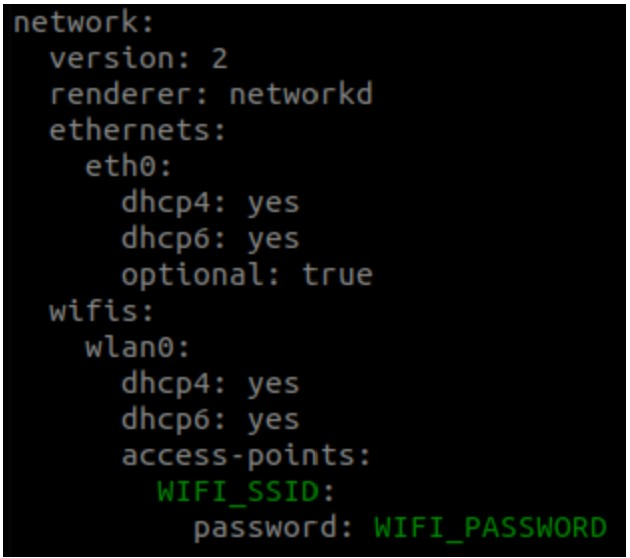

Turtlebot3 "Michelangelo" or Mikey operates on ROS Noetic https://emanual.robotis.com/docs/en/platform/turtlebot3/sbc_setup/#sbc-setup. Steps to connect to Mikey are detailed below.
  
**HRI Lab Set-Up**  
NETGEAR95_5G  
youngrabbit671

# Connection Steps 
  
## Configure Turtlebot Wi-Fi Network Settings
These steps are necessary if you need to connect a PC and Turtlebot to a new network. N.B.: Connecting the host PC and Turtlebot to a network with internet allows the user to complete downloads and updates; however internet is not required for ROS operation.  
1) Remove the Turtlebot's onboard Raspberry Pi micro SD card and insert it onto a PC.  
2) Open a new terminal and navigate to `cd /media/$USER/writable/etc/netplan`. If this path does not exist you will have to manually mount the micro SD card.
3) Edit the network file with `sudo nano 50-cloud-init.yaml`.
4) When the editor is opened, replace the WIFI_SSID and WIFI_PASSWORD with your wifi SSID and password (see below). Save and exit the file, close the terminal, and return the Raspberry Pi's memory card to the Turtlebot.  
  
  
  
## Connecting to new host PC 
These steps are necessary if you need to connect a new PC to the Turtlebot over an already configured network. The following steps assume the PC and Turtlebot are connected to the same network.

### Configuring Remote PC's ROS Network
In the terminal of the host or remote PC:
1) Use `ifconfig` to record the remote PC's IP address. The IP address is usually under a WLP connection.  
2) Use `nano ~/.bashrc` to modify the `ROS_MASTER_URI` and `ROS_HOSTNAME` to the PC's IP, like:  
        `export ROS_MASTER_URI=http://{IP_ADDRESS_OF_REMOTE_PC}:11311`  
        `export ROS_HOSTNAME={IP_ADDRESS_OF_REMOTE_PC}`  
4) Implement the bashrc file using the command `source ~/.bashrc`.  

### Configuring Turtlebot's ROS Network
4) Connect the Raspberry Pi to a monitor using HDMI to HDMI cable and to a keyboard using a USB-A port.  
5) Power the turtlebot via the OpenCR using the provided charger and use the OpenCR switch to turn the turtlebot. When the Raspberry Pi boots, a terminal will open directly.
6) Use the login `ubuntu` and password `turtlebot`
7) Use `ifconfig` to record the Turtlebot's IP address. The IP address is usually under a WLAN connection.  
8) Use `nano ~/.bashrc` to modify the `ROS_MASTER_URI` and `ROS_HOSTNAME` to the PC's IP and the Turtlebot's IP respectively, like:  
         `export ROS_MASTER_URI=http://{IP_ADDRESS_OF_REMOTE_PC}:11311`  
         `export ROS_HOSTNAME={IP_ADDRESS_OF_RASPBERRY_PI_3}`  
9) Implement the bashrc file using the command `source ~/.bashrc`.  

## Preparing the host PC and Turtlebot for ROS operation
Assuming the turtlebot is on.  
10) Run `roscore` on the remote PC.  
11) Connect to the Turtlebot using `ssh ubuntu@{IP_ADDRESS_OF_PI}` and then the password `turtlebot`.  
12) Using the same terminal, bringup basic packages to start Turtlebot3 applications for remote control `roslaunch turtlebot3_bringup turtlebot3_robot.launch`.  
  
The Turtlebot is now able to communicate with ROS on the remote PC.

## Teleoperation
13) In a new terminal on the remote PC, `export TURTLEBOT3_MODEL=${TB3_MODEL}`  
14) `roslaunch turtlebot3_teleop turtlebot3_teleop_key.launch`  
